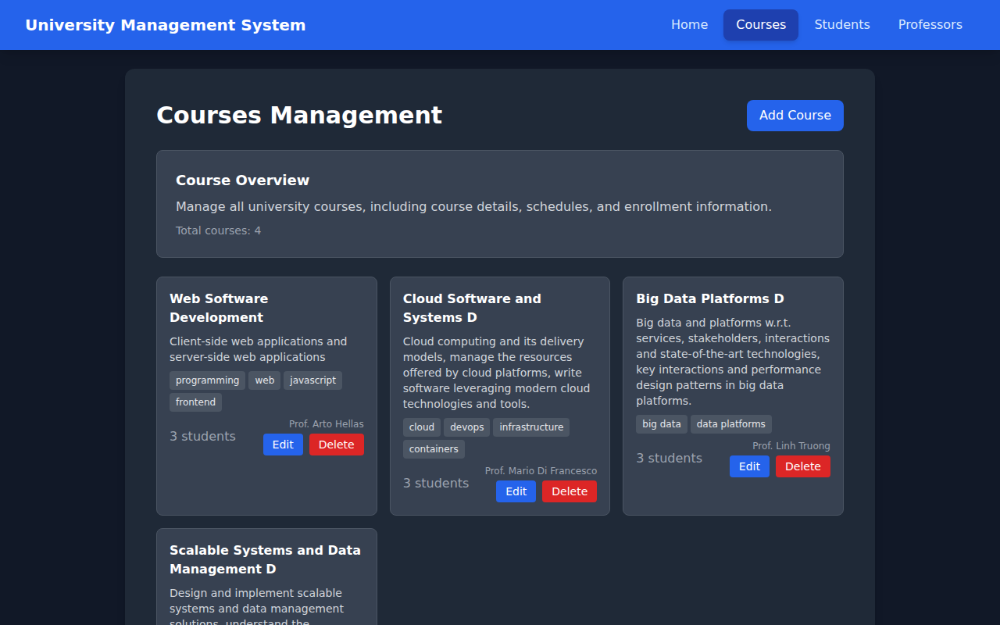
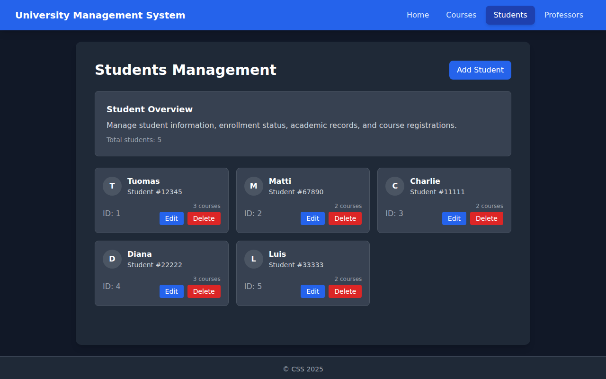

# Fullstack Kubernetes Deployment

[](https://github.com/weiyinfang/fullstack-kubernetes-deployment/actions/workflows/ci.yml)

A course management web app, with a React frontend, a Node.js API and a PostgreSQL database,
packaged as Docker images and deployed to a Kubernetes cluster. Users manage students, courses and
professors, enrol students in courses and assign professors to them. The cluster runs two
replicas each of the frontend and the API, one database with a persistent volume, and a one-off
Job that creates the schema and loads sample data. Credentials come from a Kubernetes Secret, and
readiness and liveness probes decide when a pod gets traffic and when it is restarted.

| Layer | Stack | Image |
|---|---|---|
| Frontend | React 19, Vite, Tailwind CSS, served by Nginx | `reactjs-ui:v1` |
| API | Node.js 18, Express 5, Sequelize | `nodejs-backend:v1` |
| Database | PostgreSQL 17 | `postgres:17-alpine` |

Every push is deployed to a fresh kind cluster by CI (see Continuous integration), which takes
these screenshots of the running app:





## Architecture

```
browser
  -> frontend Service :80       Nginx, 2 replicas
       /         the built React app
       /api/*    proxied to backend:3000
       /health   answered by Nginx, for the probes
  -> backend Service :3000      Express, 2 replicas
       /api/students, /api/courses, /api/professors, /api/health
  -> postgres Service :5432     PostgreSQL, 1 replica
       data on postgres-pvc, bound to a hostPath volume at /mnt/data

db-migration Job                runs `npm run migrate` once against postgres
```

The browser only talks to Nginx. The built frontend calls relative `/api/...` URLs and Nginx
forwards them to the `backend` Service, so the API address is never baked into the JavaScript and
no CORS setup is needed.

Each pod waits for what it depends on before it starts. The backend and the migration Job have an
init container that loops on `nc -z postgres 5432`, and the frontend's loops on
`nc -z backend 3000`. Both use `busybox`.

Migrations run in their own Job. If the API ran them on startup, its two replicas would run the
same migrations at the same time.

The database volume has a `Retain` reclaim policy, so the data outlives the pod and the claim.

## Building the images

You need Docker, `kubectl` and a local cluster: minikube, kind or Docker Desktop's Kubernetes.

```bash
docker build -t nodejs-backend:v1 ./server   # node:18-alpine, production dependencies only
docker build -t reactjs-ui:v1     ./client   # two stages: Vite build on node:18, then nginx:stable-alpine
```

The client image is built in two stages. The first installs the dev dependencies and runs
`vite build`; the second copies only `dist/` and `nginx.conf` onto an Alpine Nginx image, so the
image that ships has no Node.js and no `node_modules`.

The manifests set `imagePullPolicy: Never`, so the cluster never pulls these two images from a
registry and they have to be in its own image store:

```bash
minikube image load nodejs-backend:v1 reactjs-ui:v1      # minikube
kind load docker-image nodejs-backend:v1 reactjs-ui:v1   # kind
```

Docker Desktop's Kubernetes shares the local image store, so it needs no extra step. On minikube
you can also run `eval $(minikube docker-env)` before `docker build` to build straight into
minikube's daemon.

## Deploying

Apply the manifests in this order:

```bash
kubectl apply -f k8s/postgres-secret.yaml     # credentials
kubectl apply -f k8s/postgresql.yaml          # volume, claim, database and its Service
kubectl apply -f k8s/migration-job.yaml       # schema and sample data
kubectl wait --for=condition=complete job/db-migration --timeout=180s
kubectl apply -f k8s/backend.yaml
kubectl apply -f k8s/frontend.yaml
kubectl port-forward svc/frontend 8080:80     # then open http://localhost:8080
```

To check that each layer is up:

```bash
kubectl get pods,svc,pvc
curl http://localhost:8080/health          # healthy        (Nginx)
curl http://localhost:8080/api/health      # {"status":"OK"} (the API, through Nginx)
curl http://localhost:8080/api/students    # the sample students (the database, through both)
```

In CI, `kubectl get pods` after the deploy looks like this:

```
NAME                            READY   STATUS      RESTARTS   AGE
pod/backend-57cc58949d-8jg2v    1/1     Running     0          25s
pod/backend-57cc58949d-cjjpz    1/1     Running     0          25s
pod/db-migration-lhnbz          0/1     Completed   0          35s
pod/frontend-c5cf7b9f5-jwfx4    1/1     Running     0          11s
pod/frontend-c5cf7b9f5-rqxhx    1/1     Running     0          11s
pod/postgres-5f865544fb-7s9zm   1/1     Running     0          41s
```

A Job's pod template cannot be changed, so running the migrations again means deleting the Job
first: `kubectl delete job db-migration`, then apply it again.

`kubectl delete -f k8s/` removes everything except the data. Because of the `Retain` policy,
`/mnt/data` stays on the node; delete it there (`minikube ssh -- sudo rm -rf /mnt/data`) for an
empty database.

| What you see | Why |
|---|---|
| `ErrImageNeverPull` | the image is not in the cluster's image store (see Building the images) |
| a pod stuck at `Init:0/1` | what it waits for is not reachable yet; `kubectl logs <pod> -c wait-for-postgres` |
| the backend in `CrashLoopBackOff` | it could not reach the database or log in; `kubectl logs deploy/backend` |
| `Route not found` from the API | Nginx stripped the `/api` prefix; `proxy_pass` must not end in `/` |
| tables missing | the migration Job failed; `kubectl logs job/db-migration` |

## Health probes

A readiness probe decides whether a pod receives traffic. While it fails, Kubernetes takes the pod
out of its Service, but leaves it running. A liveness probe decides whether the container is
restarted, after three failures in a row.

| Pod | Endpoint | Readiness: first check, interval | Liveness: first check, interval |
|---|---|---|---|
| backend | `GET /api/health` on 3000 | 10 s, 5 s | 30 s, 10 s |
| frontend | `GET /health` on 80 | 5 s, 5 s | 15 s, 10 s |

Liveness starts later and checks less often than readiness. A container that is slow to start is
kept out of the Service for a while before liveness gets a chance to restart it.

`/api/health` does not touch the database, on purpose. If it did, a short database outage would
fail the liveness probe on both API replicas and Kubernetes would restart them, which does nothing
for the database and slows recovery. The database is checked at startup instead: the init
container waits for it, and the API exits if it cannot connect.

The frontend's `/health` is answered by Nginx itself, so it says whether the web server is up,
whatever state the API is in.

PostgreSQL has no probe here. An `exec` probe running `pg_isready` would be the next step.

## Resource requests and limits

Each Deployment declares how much CPU and memory its container needs and may use. The scheduler
places a pod only on a node with the requested amount free, and a container that goes over its
memory limit is killed and restarted.

| Container | Requests (CPU, memory) | Limits (CPU, memory) |
|---|---|---|
| frontend | 50m, 32Mi | 200m, 128Mi |
| backend | 100m, 128Mi | 500m, 256Mi |
| postgres | 100m, 256Mi | 1 CPU, 512Mi |

The values are sized for a laptop cluster with two replicas of each app. Nginx serving static
files needs very little; PostgreSQL gets the most memory, for its buffers.

## Secrets

The database user and password are in a Secret, `postgres-secret`, in `k8s/postgres-secret.yaml`.
It uses `stringData`, which takes plain text; the API server stores it base64-encoded under
`data`.

Two kinds of pod read it, in two ways:

| Reader | How | Variables it gets |
|---|---|---|
| `postgres` | `envFrom.secretRef`, every key | `POSTGRES_USER`, `POSTGRES_PASSWORD`, which the image uses to create the user |
| `backend`, `db-migration` | `env[].valueFrom.secretKeyRef`, key by key | `DB_USER`, `DB_PASSWORD`, which `server/config/config.js` reads |

The host, port and database name are not secret, so they are plain `env` values.

The values in the repository (`myuser` / `mypassword`) are for a local cluster only. The file is
committed because the assignment includes it. Base64 is only an encoding, so anyone who can read
the file or the Secret can read the password. Outside a lab, the Secret would be created
with `kubectl create secret generic` and never committed, or kept encrypted with Sealed Secrets
or SOPS, or synced from a vault by the External Secrets Operator.

The postgres image reads `POSTGRES_USER` and `POSTGRES_PASSWORD` only the first time it starts on
an empty data directory. Changing the Secret later has no effect on an existing database until
`/mnt/data` is cleared.

## Continuous integration

`.github/workflows/ci.yml` runs on every push and pull request, in two jobs:

1. API tests: `npm ci` and `npm test` in `server/`. The tests mock the database, so they need no
   PostgreSQL.
2. Deploy to kind: builds both images, creates a [kind](https://kind.sigs.k8s.io/) cluster, loads
   the images into it and applies the manifests in the order above. It then calls `/health`,
   `/api/health`, `/api/students`, `/api/courses` and `/api/professors` through the frontend,
   and fails if any of them errors or returns no rows. Playwright takes the screenshots at the top
   of this file (`.github/scripts/screenshots.mjs`), and the `kubectl get` output and the
   screenshots are kept as the run's `ci-output` artifact. If a step fails, the job prints the
   pods, their events and the logs of every container.

## Running without Kubernetes

```bash
docker run -d -p 5432:5432 -e POSTGRES_USER=myuser -e POSTGRES_PASSWORD=mypassword \
  -e POSTGRES_DB=myappdb postgres:17-alpine
cd server && npm install && npm run migrate && npm start   # API on http://localhost:3000
cd client && npm install && npm run dev                    # Vite dev server, calls localhost:3000
```

`npm test` in `server/` runs the API tests.

## Project layout

```
README.md                  this file
.github/workflows/ci.yml   API tests, then a full deploy to a kind cluster
.github/scripts/           the Playwright script behind the screenshots
docs/images/               the screenshots
client/                    the React frontend
  src/components/          the students, courses and professors pages
  src/services/            the API calls, one file per resource
  Dockerfile               two stages: Vite build, then Nginx
  nginx.conf               static files, the /api proxy and /health
server/                    the Express API
  server.js                the routes
  controllers/             one controller per resource
  models/                  the Sequelize models
  migrations/              the schema and the sample data, run by the migration Job
  config/                  database and port settings, read from environment variables
  Dockerfile
k8s/
  postgres-secret.yaml     the database credentials
  postgresql.yaml          the volume, the claim, the database Deployment and its Service
  migration-job.yaml       the Job that runs the migrations
  backend.yaml             the API Deployment and Service, with probes and resource limits
  frontend.yaml            the frontend Deployment and Service, with probes and resource limits
```
